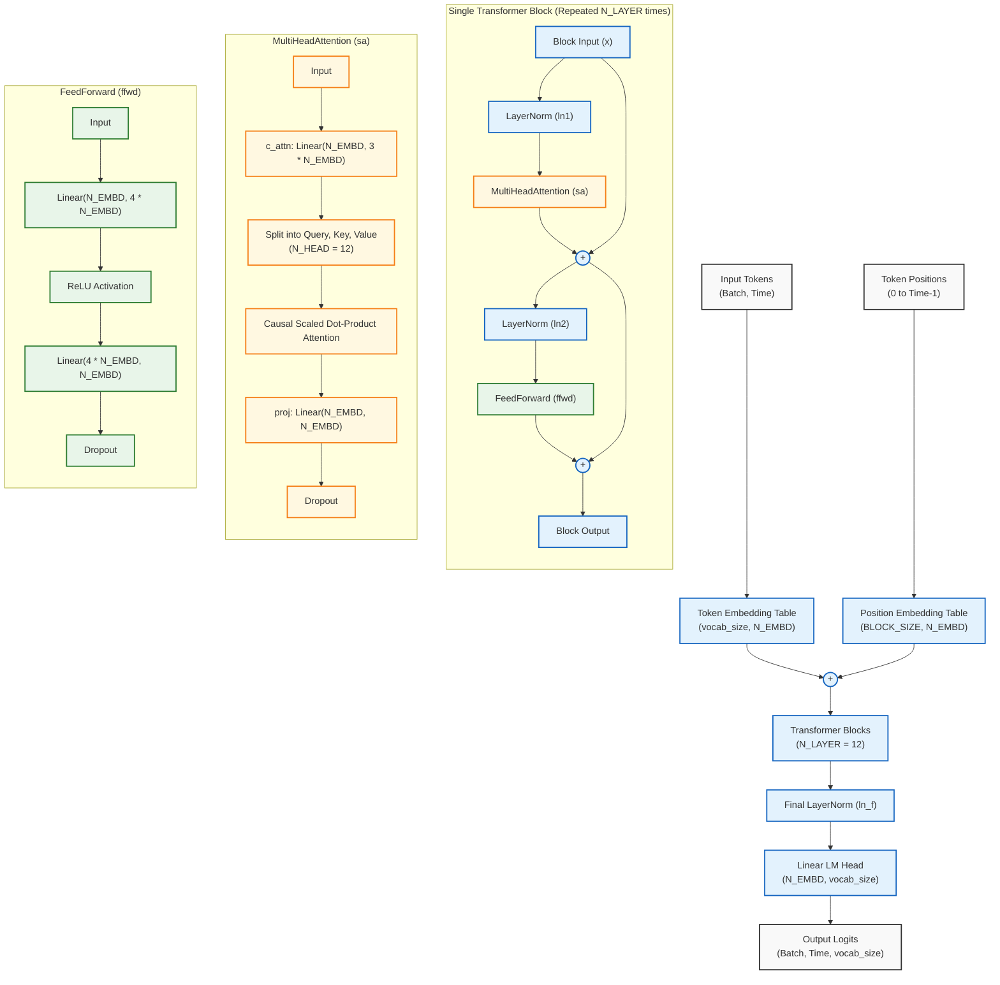

# TrumpGPT Architecture

The TrumpGPT model uses a decoder-only Transformer architecture, structurally similar to GPT-2. It is implemented in `train.py` using PyTorch. Below is the architecture diagram illustrating the flow of data through the model, from token inputs to output logits.

## Model Hyperparameters

- **Vocab Size (`vocab_size`)**: 50,257 (using `gpt2` tiktoken encoding)
- **Embedding Dimension (`N_EMBD`)**: 768
- **Number of Attention Heads (`N_HEAD`)**: 12
- **Number of Transformer Blocks (`N_LAYER`)**: 12
- **Context Size/Block Size (`BLOCK_SIZE`)**: 256 tokens
- **Dropout Rate (`DROPOUT`)**: 0.2

## Components Summary

1.  **Token & Position Embeddings**: Tokens are converted into dense vectors of size 768. A learned positional embedding is added to provide the model with a sense of sequence order.
2.  **Transformer Blocks**: The model applies 12 consecutive blocks. Each block consists of:
    *   **Layer Normalization** applied *before* the multi-head attention and feed-forward networks (Pre-LN architecture).
    *   **Multi-Head Causal Self-Attention**: Projects inputs into Query, Key, and Value matrices, splitting them across 12 heads to attend to past tokens.
    *   **Feed-Forward Network**: Expands the dimensionality by a factor of 4 (768 → 3072) with a ReLU activation, and then projects it back down to 768.
    *   **Residual Connections**: The input to each sub-layer is added back to its output, preventing vanishing gradients.
3.  **Language Modeling Head**: A final Layer Normalization followed by a linear projection back to the vocabulary size to compute the probability logits for the next token.
